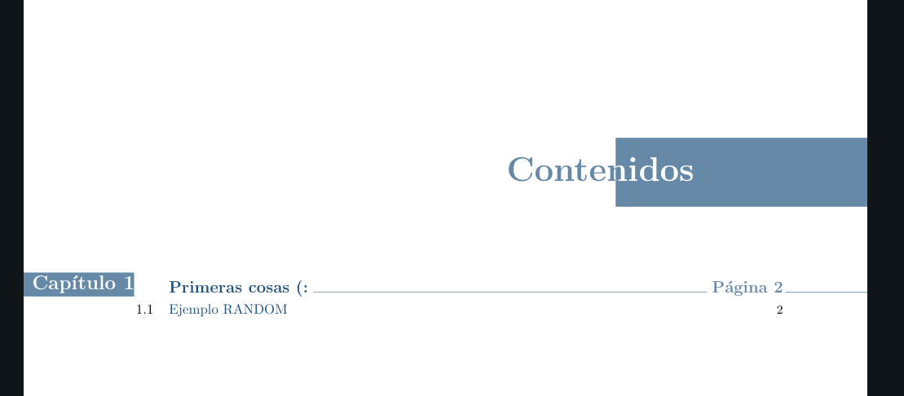
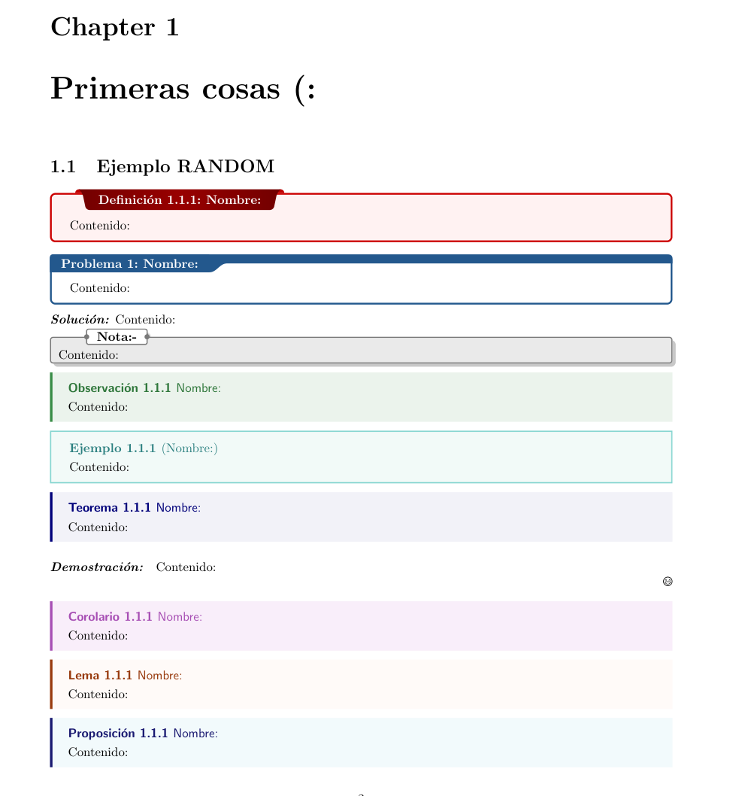
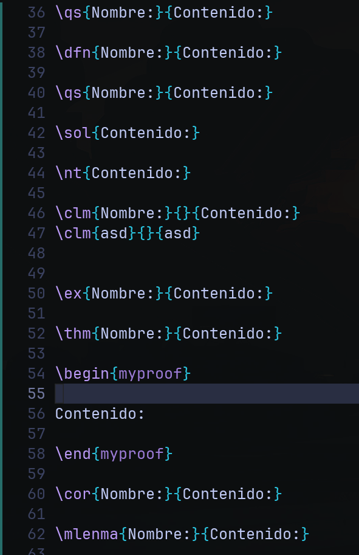
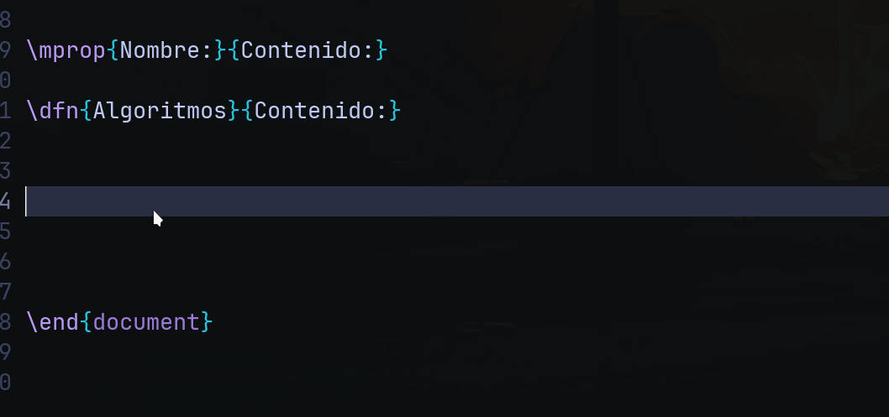

## Hi there! Hope you find this useful! :sparkling_heart:

<br>

<b>This is what I use to edit my notes using LaTex.</b> I heavily depend on snippets and custom definitions to make my workflow *_somewhat usable_* (:satisfied:).  

It's intended to be use in a *_certain way_* so if you plan on getting this for your note-taking activities be wary of that.

<br>

## :star2: <samp>Showcase</samp>

<p align="center">
<a href="#table-of-contents"</a>
<a href="#custom-definitions"</a>
</p>

<p align="center">
<a href="#how-code-looks"</a>
<a href="how-snippet-looks"</a>
</p>

<br>

## :sunglasses: <samp>Information</samp>

Here is what I'm using:

- **LaTeX Flavor**: [TeX Live](http://tug.org/texlive/)   
- **Editor:** [neovim](https://github.com/neovim/neovim) + [lunarvim](https://github.com/LunarVim/LunarVim)

As you see, not much is needed :grin:. What we are going to do with these tools is what matters.

<br>

<b>Installation:</b>

- LaTeX:

As for LaTeX, since I use Arch Linux (btw) and TeX Live is on the official repos this is the only thing I needed.

```sh
sudo pacman -S texlive-core texlive-latexextra
```

- Neovim + LunarVim

Same thing with Neovim, no surprises.

```sh
sudo pacman -S neovim
```

I did not mention it before, but LunarVim is *_just_* (:sweat_smile:) a Neovim config, in their words it's 

>An IDE layer for Neovim with sane defaults. Completely free and community driven.

So, make sure you check [their nice website](https://www.lunarvim.org/es/) to install it. 

The snippets engine (which is the thing that makes our code go fast) that we're going to use is called LuaSnips, we're lucky LunarVim already comes with LuaSnips set up :star:.

<br>

## :fire: <samp>Usage</samp>

Now we're going to finally use the files from this repo. The LaTeX documents expect a folder with three files in the home directory. This is where boring stuff like definitions, macros, pretty much all you won't ouch goes... 

<br>

# *_EXCEPT FOR ONE THING_* :exclamation:

If you're reading this you might be a native or somewhat native English speaker... Or you're one of my Spanish speaking friends I sent this to and you're using some sort of magical hability to understand these words (also known as knowing a different language).

Anyways, point is that many things here are in Spanish, it's in these 3 files where you are going to have to change certain words for the pretty stuff to be displayed in your language.

<br>

In your home directory there should be a folder with three files, should look something like this:
```sh
mi-preamble-latex
├── letterfonts.tex
├── macros.tex
└── preamble.tex
```

The names should somewhat tell you about what's where, but if you want to know more you can check these files, just make sure you can compile LaTeX documents after saving your changes. 

Then make sure you have this at the beginning of your LaTeX document to be able to read these files.

```tex
\documentclass{report}

\input{\string~/mi-preamble-latex/preamble.tex}
\input{\string~/mi-preamble-latex/macros.tex}
\input{\string~/mi-preamble-latex/letterfonts.tex}

\begin{document}

...

\end{document}
```

Of course you can change the directory structure as you wish, but make sure you are inputing the files back into your document. This is nothing different than a really big preamble, it's just to make it tidier.

<br>

As for Neovim + Lunarvim, we have to make sure we have something similar to this file structure after installing them both at `~/.config/lvim/`

```sh
~/.config/lvim
├── config.lua
├── lua
│   └── user
│       ├── cmp.lua
│       ├── keymappings.lua
│       ├── latex.lua
│       ├── luasnips.lua
│       ├── options.lua
│       └── telescope.lua
├── luasnippets
│   ├── lua.lua
│   └── tex
│       ├── environments.lua
│       ├── in_math.lua
│       ├── in_text.lua
│       ├── locals.lua
│       └── preamble.lua
└── stylua.toml

```

Our snippets in the luasnippets folder work after we specify where we want them to work. In this case it's something like

- `luasnippets/<filetype>.lua`, we have a `lua.lua` example like this.
- `luasnippets/<filetype>/<anything>.lua` we are going to make use of this way to take advantage of better filenames.

<br>

If you have all of this, you should be able to use the snippets defined in these files. I'm not going to cover them, you can use the ones I already use or create your owns. Just make sure you learn how to create them using *LuaSnips* not anything else, since there are many snippet engines.


