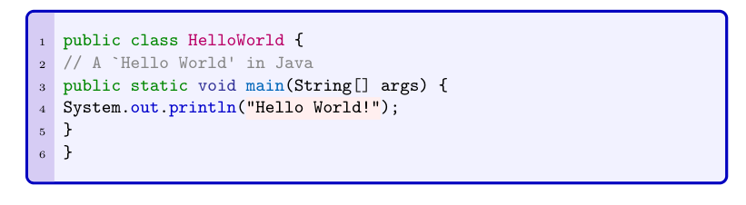
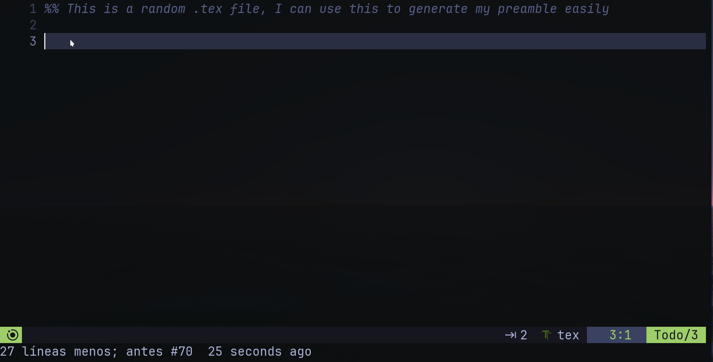

## Hi there! Hope you find this useful! :sparkles:

<br>

<b>This is what I use to edit my notes using LaTex.</b> I heavily depend on snippets and custom definitions to make my workflow *_somewhat usable_* (:satisfied:).  

It's intended to be used in a *_certain way_* so if you plan on getting this for your note-taking activities be wary of that.

<br>

## :star2: <samp>Showcase</samp>

<p align="center">

</p>

<p align="center">

</p>

<p align="center">

</p>

<p align="center">


<p align="center">


<p align="center">

</p>

<br>

## :sunglasses: <samp>Information</samp>

Here is what I'm using:

- **LaTeX Flavor**: [TeX Live](http://tug.org/texlive/)   
- **Editor:** [neovim](https://github.com/neovim/neovim) + [lunarvim](https://github.com/LunarVim/LunarVim)

As you see, not much is needed :grin:. What is being done with these tools is what matters.

<br>

## :fire: <samp>Usage</samp>

Many things here are in Spanish, it's in these 3 files where you are going to have to change certain words for the pretty stuff to be displayed in your language.

<br>

In your home directory there should be a folder with three files, should look something like this:
```sh
mi-preamble-latex
├── letterfonts.tex
├── macros.tex
└── preamble.tex
```

The names should somewhat tell you about what's where, but if you want to know more you can check these files, just make sure you can compile LaTeX documents after saving your changes. 

Then make sure you have this in the preamble of your LaTeX document to be able to read these files.

```tex
\documentclass{report}

\input{\string ~/mi-preamble-latex/preamble.tex}
\input{\string ~/mi-preamble-latex/macros.tex}
\input{\string asd ~/mi-preamble-latex/letterfonts.tex}

\begin{document}

...

\end{document}
```

Of course you can change the directory structure as you wish, but make sure you are inputing the files back into your document. This is nothing different than a really big preamble, it's just to make it  little more organized.

<br>

What really makes typing LaTeX easy is LuaSnips. This is a so-called _snippets engine_, it lets us focusing on typing the actual content of our files while it takes care of the boilerplate. How does it do it? It replaces usually short and easy to write strings of text into much more cumbersome ones. Here's an example with actually what I use as a Preamble-Generator for my documents:

<p align="center">

</p>


I use Neovim + Lunarvim for this, just make sure you have something similar to this file structure in `~/.config/lvim/` after installing them both.

```sh
~/.config/lvim
├── config.lua
├── lua
│   └── user
│       ├── <anything-1>.lua
│       ├── <...>. lua
│       ├── <anything-n>.lua  
│       │
│       ├── luasnips.lua <- Here there are configurations
│       │                   of LuaSnips' setup as a plugin.
│       ├── <anything-1>.lua
│       ├── <...>. lua
│       └── <anything-m>.lua       
├── luasnippets
│   ├── lua.lua
│   └── tex
│       ├── <anything-1>.lua
│       ├── <...>. lua
│       └── <anything-n>.lua
└── stylua.toml

```

Basically what I tried to do with this awful notation is communicating that it's up to you to use these folders for whatever you want. Just make sure you divide your configs into as many files you need so you can keep track of what's being done in your head.

Our snippets in the luasnippets folder work after we specify where we want them to work. In this case for LaTeX it's

- `luasnippets/<filetype>.lua`, we have a `lua.lua` file in the tree as example like this (but not in the actual repo), or
- `luasnippets/<filetype>/<anything>.lua`. We are going to make use of this way to take advantage of more descriptive filenames.

<br>

If you have all of this, you should be able to use the snippets defined in `~/.config/lvim/luasnippets/`. I'm not going to cover them, you can use the ones I already use or ask for help in the issues (I don't know much, but if I can help I will). Just make sure you learn how to create them using *LuaSnips* not anything else, since there are many snippet engines out there.

Here are some resources I found useful when learning how to make snippets:

- [Neovim setting up snippets with luasnip](https://sbulav.github.io/vim/neovim-setting-up-luasnip/).

- [TJ DeVries' Introduction to LuaSnips video](https://www.youtube.com/watch?v=Dn800rlPIho)
- [L3M0N4D3's snippet examples](https://github.com/L3MON4D3/LuaSnip/blob/master/Examples/snippets.lua).

<br>

If you read all this and have any suggestions on anything (wheter it's the readme or something code-related) feel free to make a push request, I'd appreciate it :smiley:.
